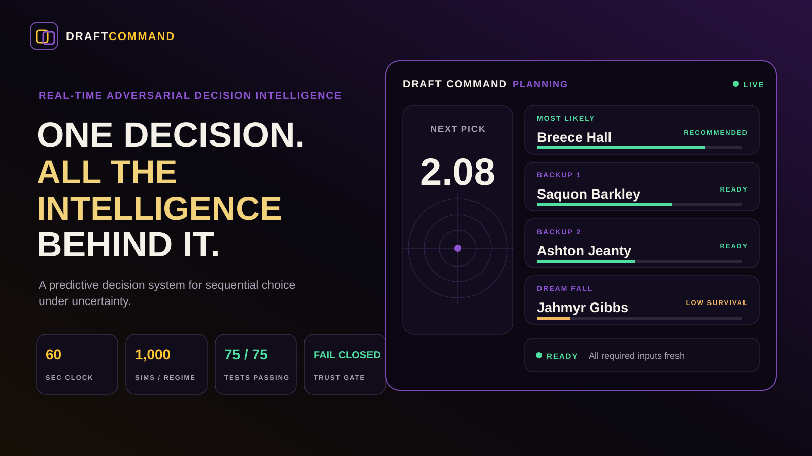
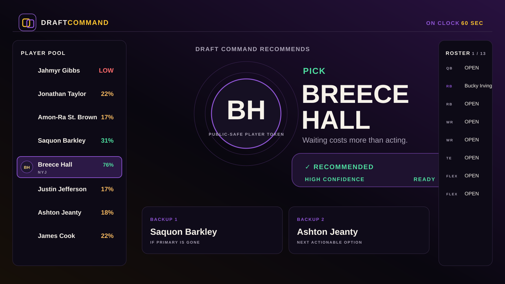
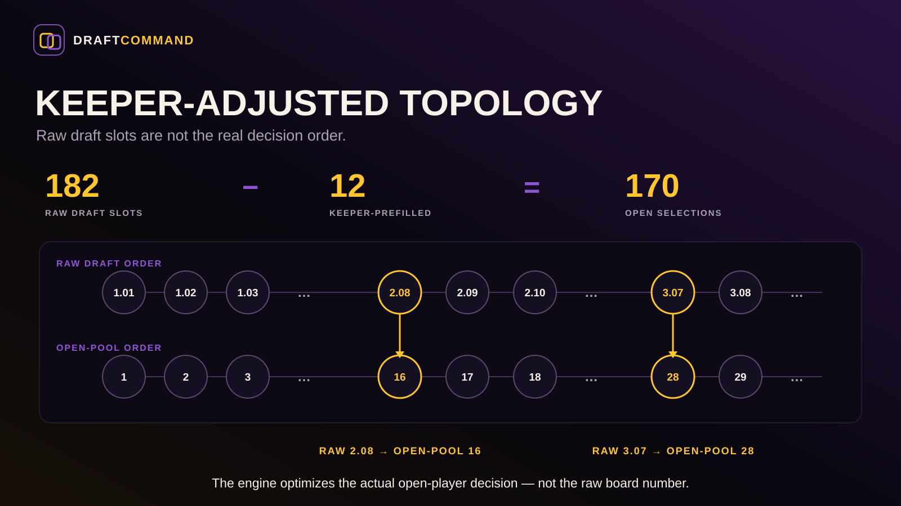
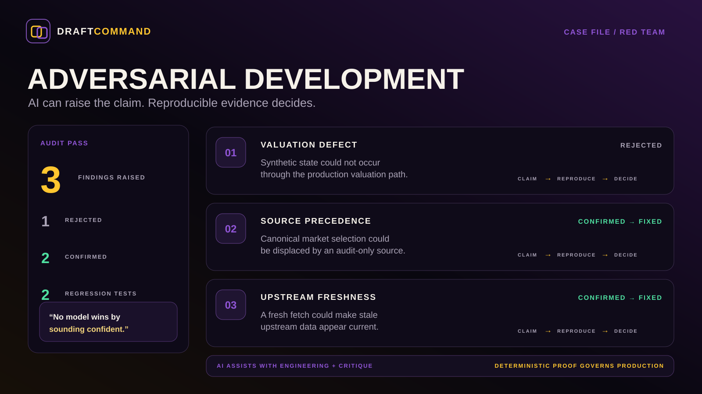

  

# Draft Command

**Real-Time Adversarial Decision Intelligence**

*A predictive decision system for sequential choice under uncertainty.*

Draft Command treats a live fantasy draft as a decision environment—not a rankings page. It turns changing state, roster context, market uncertainty, and the cost of waiting into one actionable recommendation for the decision **right now**.

> **One decision. All the intelligence behind it.**

---

## What you get

| | |
|---|---|
| **The pick** | One current recommendation when it is your turn. |
| **The fallback plan** | Ranked backups if the board changes before you act. |
| **The reason** | A concise explanation designed to scan under pressure. |
| **The risk of waiting** | A signal for whether delaying the decision is likely to cost value. |
| **Your context** | Guidance shaped by roster, league rules, live board, and future decision opportunities. |
| **Confidence with boundaries** | If the evidence is not good enough, Draft Command withholds the recommendation instead of bluffing. |

  

The interface is intentionally simpler than the machinery behind it.

---

## A predictive decision system, not a prediction system

Prediction asks:

> **What will happen?**

Decision intelligence asks:

> **Given what may happen, what should I do now?**

Draft Command is designed around the second question.

Formally, the problem is a **finite-horizon, sequential, partially observable, multi-agent decision environment**: independent actors compete for scarce options, every action changes shared state, and the next decision must be made under uncertainty and time pressure.

Fantasy football is the proving ground. The systems pattern is broader.

---

## What rankings do not understand

Raw pick numbers can be misleading in a keeper league. Availability depends on the number of **open-player selections** that occur before the user acts—not simply the number printed on the draft board.

  

In the verified test environment:

- raw **2.08** is open-player decision **16**
- raw **3.07** is open-player decision **28**
- **182** raw slots become **170** open selections after keeper-prefilled slots are removed

That topology is established before market availability is modeled.

---

## The Decision Stack

Draft Command separates **truth, uncertainty, and judgment**.

**GROUND TRUTH → VALUATION → MARKET → OPPORTUNITY COST → ACTION**

**Ground truth** establishes identity, rules, state, and provenance.  
**Valuation** asks what an option is worth in this exact environment.  
**Market modeling** represents uncertain future availability.  
**Opportunity cost** asks what is lost by waiting.  
**The decision surface** compresses all of that into a human action.

**Deterministic code owns numerical truth.** Probabilistic modeling represents uncertainty. AI assists with engineering, critique, and explanation—it does not get to invent scoring, state, or arithmetic.

> **The football-specific inputs change. The decision architecture does not.**

---

## Proof, not the recipe

The public repository shows evidence that the system behaves as intended without publishing the private competition model.

| Verified behavior | Result |
|---|---:|
| Draft-room realizations exercised | **192** |
| Scenario regimes | **4** |
| Simulations per regime | **1,000** |
| Deepest keeper-adjusted decision exercised | **164** |
| Market-backed alternatives remaining at the final owned pick | **59** |
| Production regression suite | **75 / 75 passing** |
| Local decision computation | **sub-second** |
| Live decision clock | **60 seconds** |

The point is not benchmark theater. The point is whether the system remains trustworthy and usable inside the actual decision window.

---

## AI-assisted engineering. Deterministic proof.

AI was used in multiple roles rather than as a single unquestioned builder.

  

The workflow is:

**BUILD → INDEPENDENT AUDIT → REPRODUCE → REGRESSION TEST → ACCEPT OR REJECT**

In one adversarial pass:

- one apparent valuation defect was **rejected** because its synthetic state could not occur through the production valuation path
- a canonical-market source precedence defect was **confirmed, regression-tested, and fixed**
- stale upstream data being made to appear fresh by a new fetch was **confirmed, regression-tested, and fixed**

The operating rule:

> **No model wins by sounding confident.**

AI can generate hypotheses quickly. Reproducible evidence decides whether production changes.

---

## Trust architecture

Draft Command is designed to **fail closed, not confidently wrong**.

A recommendation can be withheld when required inputs are stale, incomplete, ambiguous, or outside the trust contract. The user keeps the surrounding context; the system removes the false certainty.

Brand color and semantic color are also separated:

- **purple / gold** — product identity
- **green** — positive / ready / recommended
- **amber** — caution / review
- **red / coral** — blocked / stale / negative

That keeps status meaning stable even if the product is later themed around a different favorite team.

---

## Public showcase boundary

This is a **product and architecture showcase**, not the private competition system.

The public repo intentionally includes:

- product and UX framing
- high-level decision architecture
- sanitized examples
- public-safe technical diagrams
- verification methodology
- a static showcase site

It intentionally does **not** publish:

- private league identifiers or exports
- private messages or chat-derived signals
- the operational database
- exact weighting and tuning
- source-specific competitive edge
- private heuristics or strategic playbooks
- credentials or tokens

The goal is to show the quality of the decision architecture without publishing the competitive recipe.

---

## Go deeper

- [Case study](docs/CASE_STUDY.md)
- [Public architecture](docs/ARCHITECTURE.md)
- [Brand system](docs/BRAND_SYSTEM.md)
- [Live product showcase](https://madebychaas.github.io/draft-command/)

---

## About the project

Draft Command started with a deceptively simple question:

> **Who should I draft?**

The more useful question became:

> **What should I do now, given what is true, what is uncertain, what may disappear, and what it costs to wait?**

That is the project.

---

Draft Command is an independent portfolio project and is not affiliated with or endorsed by Sleeper, the NFL, the Minnesota Vikings, or any NFL team. The public showcase uses neutral player tokens; licensed player media can be added separately where permitted.
